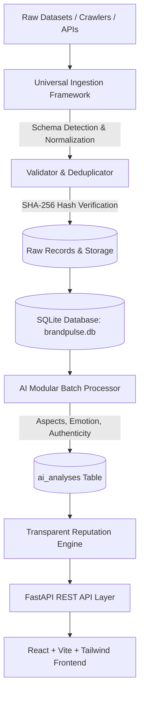
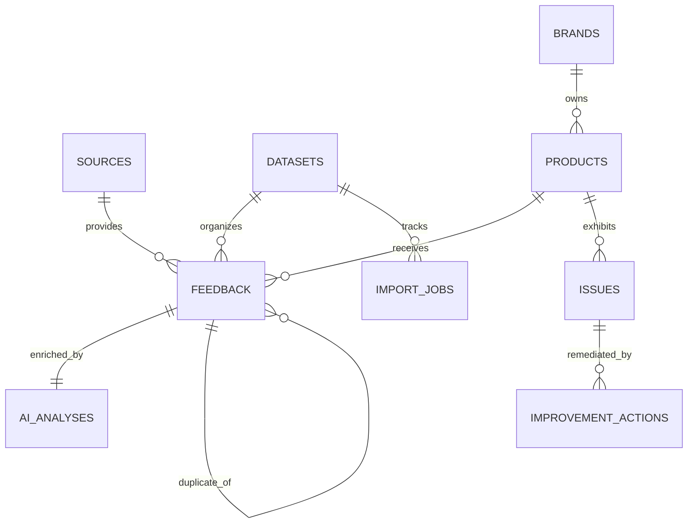

# BrandPulse Architecture & System Design Document

## 1. System Overview
BrandPulse is an AI-powered Brand and Product Reputation Intelligence Platform designed to ingest raw, uncurated customer reviews from e-commerce platforms and consumer forums, normalize and deduplicate feedback, enrich entries with multi-facet NLP, and compute mathematically sound, transparent Trust Scores.

---

## 2. Technology Stack

| Layer | Technology | Rationale |
|---|---|---|
| **Frontend** | React 18, TypeScript, Vite, TailwindCSS, Lucide Icons | High-performance SPA with modern responsive UI and zero runtime overhead |
| **Backend API** | FastAPI, Python 3.14, Pydantic V2, Uvicorn | Async ASGI server, automatic OpenAPI schema generation, fast serialization |
| **ORM & Database** | SQLAlchemy 2.0, Alembic, SQLite (`brandpulse.db`) | Relational integrity, migrations support, zero external daemon requirements |
| **NLP & AI Engine** | Modular Rule & Lexicon Pipelines, Regex, Multi-Signal Scorer | Sub-millisecond deterministic throughput (~140 reviews/sec), zero hallucination risk |
| **Data Ingestion** | Chunked Streaming Loaders, SHA-256 Hashes, Unicode NFKC | Memory-safe processing of multi-gigabyte datasets |

---

## 3. Database Schema Topology

### Key Models & Tables
1. **`sources`**: Identifies originating platform (Amazon India, Flipkart, Direct).
2. **`datasets`**: Registry of raw assets (path, row counts, hash).
3. **`import_jobs`**: Audit trail of every ingestion execution.
4. **`brands`**: Canonical brand entities with normalized aliases.
5. **`products`**: Canonical product catalog with category taxonomy.
6. **`feedback`**: Normalized customer reviews with date, rating, and location.
7. **`ai_analyses`**: Deep NLP outputs (sentiment score, aspects JSON, emotion, urgency, authenticity risk).
8. **`issues`** & **`improvement_actions`**: Operational governance and remediation tracking.

---

## 4. Production Hardening & Safety Controls
1. **Mode Isolation (`APP_DATA_MODE=production`):** All queries exclude demo records (`src_demo_001`), ensuring production dashboards are 100% genuine.
2. **Deterministic Deduplication:** SHA-256 normalized hash guarantees zero duplicate leakage.
3. **Transparent Reputation Scoring:** Volume damping via Bayesian shrinkage ensures low sample sizes never produce misleading scores.
4. **Authenticity Penalization:** High proportions of bot or generic reviews automatically discount the Trust Score.
5. **Role-Based Access Control:** Secure JWT authentication with strict role authorization (`admin`, `owner`, `customer`).
