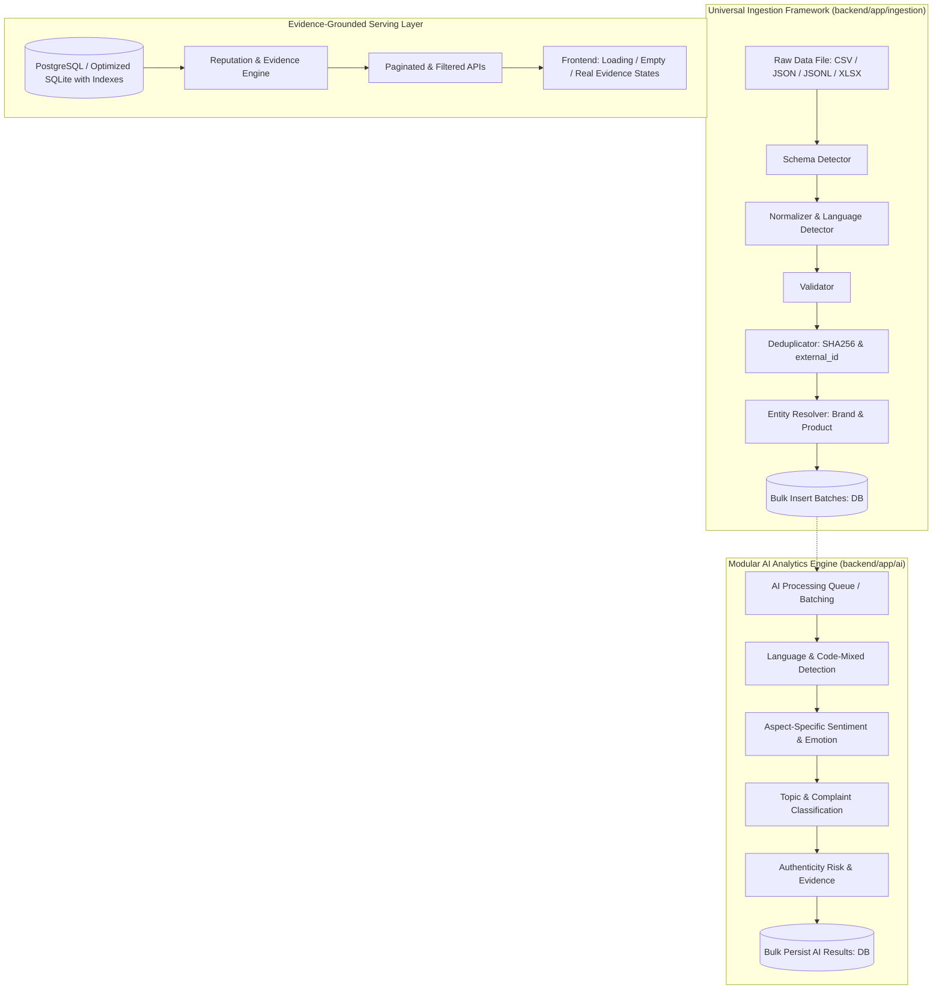

# BrandPulse AI — Comprehensive Architecture & Data Audit

**Date:** 2026-09-23  
**Status:** Complete  
**Scope:** Full repository audit across backend, frontend, data, scripts, tests, configuration, and database layers.

---

## 1. Executive Summary

BrandPulse AI was conceptualized as a universal, evidence-grounded brand and product reputation intelligence platform. However, an in-depth audit of the repository reveals that the existing codebase operates primarily as a demonstration prototype heavily contaminated with synthetic data, hardcoded heuristics, and fragile ingestion scripts.

Key findings:
1. **Pervasive Demo Contamination:** The current SQLite database (`brandpulse.db`) contains 4,139 feedback records and 32 products. Every single feedback record is mapped to a hardcoded demo source (`src_demo_001`), and every imported product was forcibly created in the `Smartphone` category with generic naming (`Imported Product (XYZ)`) and dummy brand `brd_001`.
2. **Hardcoded Fallbacks Everywhere:** Both backend API endpoints (`products.py`, `ai.py`, `owner.py`) and frontend pages (`CustomerHome.tsx`, `ProductSearch.tsx`, `ProductComparison.tsx`, `ProductTrustExplorer.tsx`, `OwnerOverview.tsx`, `OwnerDNAGraph.tsx`, `AIAssistant.tsx`, `PersonalFitFinder.tsx`) contain hardcoded fallback arrays, synthetic reputation scores (e.g., 85.0%, 94%), mock timelines (`2026-Jan, Feb, Mar`), and invented alerts.
3. **No True Ingestion Architecture:** `scripts/import_real_data.py` is a 720-line monolithic script that commits every review individually to the database (`db.commit()` inside loops), invents random locations using `random.choice(location_cities)`, and falls back to hardcoded restaurant and smartphone reviews.
4. **Rich Real Datasets Exist but are Mismanaged:** 83,174 real records exist in `data/brandpulse_full_corpus.jsonl` and 11 Kaggle CSV files covering Indian mixer grinders (Bosch, Philips, Sujata, Bajaj, Preethi), smartphones, laptops, and consumer products. However, they lack schema detection, deduplication, normalized hashing, Indian date parsing, and language detection.
5. **Security & Authentication Backdoors:** `app/dependencies.py` automatically authenticates unauthenticated requests as `customer@brandpulse.ai` if no token is provided.

---

## 2. Current Architecture Overview

```mermaid
graph TD
    subgraph Client["Frontend (Vite + React 18 + TS + Tailwind)"]
        UI_Cust[Customer Pages: Home, Search, Trust Lens, Compare, Fit Finder]
        UI_Owner[Owner Pages: Overview, DNA Graph, Command Center, Actions]
        UI_Admin[Admin Dashboard]
    end

    subgraph Backend["Backend (FastAPI + SQLAlchemy)"]
        API[API Routers: products, feedback, ai, owner, admin, auth]
        Auth[JWT / Insecure Anonymous Fallback]
        AI_Pipe[Synchronous Mock AI Pipeline]
        Demo_Svc[Demo Data Seeder (27KB hardcoded)]
    end

    subgraph Storage["Storage Layer"]
        DB[(SQLite: brandpulse.db)]
        DataDir[data/ (60MB JSONL, Kaggle CSVs, Market Snapshots)]
    end

    UI_Cust --> API
    UI_Owner --> API
    UI_Admin --> API
    API --> DB
    API --> AI_Pipe
    Demo_Svc --> DB
```

### Limitations of Current Architecture:
- No background task queue or async worker layer for large data ingestion.
- Database access is purely synchronous SQLite with separate DB files (`brandpulse.db` at root and `backend/brandpulse.db`).
- Ingestion is tightly coupled to direct DB models rather than going through raw staging -> normalization -> validation -> deduplication -> entity resolution -> bulk persistence.

---

## 3. Backend Architecture Audit

### 3.1 Directory Structure & Components
- `backend/app/main.py`: Creates tables via `Base.metadata.create_all`, runs `seed_demo_data(db)` on startup if `DEMO_MODE=True`, registers CORS (`*`), exposes `/health`, `/health/database`, `/health/ai`.
- `backend/app/config.py`: Uses `pydantic-settings`. Configures `SECRET_KEY`, `DATABASE_URL` (defaults to `sqlite:///./brandpulse.db`), `DEMO_MODE` (default `True`), `USE_MOCK_AI` (default `True`).
- `backend/app/database.py`: SQLAlchemy `create_engine` with `check_same_thread=False` for SQLite.
- `backend/app/dependencies.py`:
  - **Critical Flaw:** Lines 13–18 fallback to returning a customer user if no token is present:
    ```python
    if not token:
        demo_user = db.query(User).filter(User.email == "customer@brandpulse.ai").first()
        if demo_user:
            return demo_user
    ```
- `backend/app/api/`:
  - `products.py`: Returns fake reputation scores (`trust_score = 85.0`, `confidence = 0.94`, `data_freshness = "Updated 2 hours ago"`) when feedback is missing. Returns hardcoded 3-month timeline (`2026-Jan`, `Feb`, `Mar`).
  - `feedback.py`: Commits every single imported feedback one-by-one. Hardcodes `source_id = "src_demo_001"`. Creates generic `Smartphone` products for missing IDs.
  - `owner.py`: Returns hardcoded alerts for "Apex Phone Pro X" and "ZenithBook Ultra 15". Returns static DNA graph nodes.
  - `ai.py`: Wraps keyword-matching functions. Returns hardcoded chat responses referencing "Apex Phone Pro X" regardless of the user's question or product.
  - `admin.py`: Lists users, audit logs, system health.
  - `auth.py`: Registration, login with bcrypt password hashing and JWT token creation.

---

## 4. Frontend Architecture Audit

### 4.1 Technologies & Setup
- Vite 5 + React 18 + TypeScript + TailwindCSS 3 + Axios + Lucide React.
- Routing via `react-router-dom` with 13 page components.

### 4.2 Hardcoded Data & Synthetic Fallbacks Audit
Every major page in `frontend/src/pages/` has hardcoded synthetic fallbacks in catch blocks or directly in component state:

| Page | File | Hardcoded / Demo Contamination |
|---|---|---|
| **Customer Home** | `CustomerHome.tsx` | Hardcoded score array `[92.0, 88.5, 95.1, 90.4...]` mapped via `idx % 8`. Hardcoded review count array `[1200, 200, 200, ...]`. Hardcoded category review counters. |
| **Product Search** | `ProductSearch.tsx` | Catch block silently renders 4 fake products ("Bosch TrueMixx Pro", "Philips Viva", "Apex Phone Pro X", "Amazfit Balance"). |
| **Product Comparison** | `ProductComparison.tsx` | Purely hardcoded state comparing Bosch TrueMixx Pro and Sujata Dynamix with static scores (`batteryScore: 94`, `cameraScore: 90` displayed as "Motor & Grinding Power" and "Build Quality"). |
| **Product Trust Explorer** | `ProductTrustExplorer.tsx` | Hardcoded reputation profile in catch block with 1,200 fake reviews, 92% trust score, and static dimension explanations. |
| **Operations Command** | `OwnerOverview.tsx` | Hardcoded overview metrics (`active_reputation_index: 94`, `reputation_trend: '+18 pts'`). Hardcoded alerts (`appr_49712dd9` for Apex Mobile, `appr_88201fa2` for Bosch). |
| **Reputation DNA Graph** | `OwnerDNAGraph.tsx` | Hardcoded nodes and edges for "Apex Phone Pro X" thermal throttling and firmware patch v2.1.1. |
| **AI Assistant** | `AIAssistant.tsx` | Hardcoded response: `"Based on evidence corpus for Apex Phone Pro X: Battery life receives 82% positive ratings..."` |
| **Personal Fit Finder** | `PersonalFitFinder.tsx` | Hardcoded result in catch block for "Apex Phone Pro X (India Edition)". |
| **Admin Dashboard** | `AdminDashboard.tsx` | Hardcoded user list and audit logs in catch block. |

---

## 5. Database Architecture Audit

### 5.1 Tables & Schema State
Current tables in `brandpulse.db`:
- `users`: `id`, `name`, `email`, `password_hash`, `role`, `is_active`, `created_at`, `updated_at`.
- `brands`: `id`, `name`, `description`, `website`, `category`, `owner_id`, `verification_status`, `created_at`, `updated_at`.
- `products`: `id`, `brand_id`, `name`, `description`, `category`, `model`, `version`, `price`, `features`, `image_url`, `status`, `created_at`, `updated_at`.
- `sources`: `id`, `name`, `source_type`, `source_url`, `reliability_level`, `last_synced_at`. (Currently contains only `src_demo_001`).
- `feedback`: `id`, `product_id`, `source_id`, `review_text`, `rating`, `review_date`, `language`, `location`, `product_version`, `verified_flag`, `quality_status`, `created_at`.
- `ai_analyses`: `id`, `feedback_id`, `sentiment`, `emotion`, `aspects`, `topics`, `complaint_type`, `urgency`, `authenticity_signals`, `confidence`, `model_name`, `created_at`.
- `reputation_snapshots`: `id`, `product_id`, `time_period`, `dimension`, `score`, `evidence_count`, `confidence`, `trend`, `created_at`.
- `issues`: `id`, `product_id`, `title`, `description`, `category`, `severity`, `frequency`, `trend`, `confidence`, `status`, `created_at`, `updated_at`.
- `improvement_actions`: `id`, `product_id`, `issue_id`, `owner_id`, `title`, `description`, `priority`, `status`, `due_date`, `completed_at`, `created_at`.
- `audit_logs`: `id`, `user_id`, `action`, `entity_type`, `entity_id`, `metadata_info`, `created_at`.
- `reports`: `id`, `product_id`, `created_by`, `report_type`, `file_path`, `created_at`.

### 5.2 Critical Schema Deficiencies
1. **No Normalized Name / Model:** Neither `brands` nor `products` has a `normalized_name` or `normalized_model` column with unique/lookup indexes.
2. **Missing Identifiers:** `products` lacks `asin`, `sku`, `gtin`, `upc`, `currency`, `country`, `market`, and `product_url`.
3. **No Dataset / Import Registry:** No `datasets` or `import_jobs` table exists. Imports cannot be tracked, paused, resumed, or audited.
4. **No Raw Ingestion Layer:** No table stores raw JSON payloads or references before normalization. Raw source provenance is completely lost.
5. **No Deduplication Hashes:** `feedback` lacks `raw_hash`, `normalized_hash`, `external_review_id`, `review_title`, `helpful_votes`, `review_url`, `country`, `state`, `city`, `language_confidence`.
6. **Missing Indexes:**
   - `feedback.source_id` is NOT indexed.
   - `feedback.rating` is NOT indexed.
   - `feedback.language` is NOT indexed.
   - `ai_analyses.sentiment`, `ai_analyses.complaint_type`, `ai_analyses.urgency` are NOT indexed.
   - `products.asin`, `products.sku`, `products.market` do not exist and are not indexed.
7. **Database Duplication:** Two SQLite databases exist: `brandpulse.db` (root, 4.5 MB, 4,139 records) and `backend/brandpulse.db` (229 KB, 28 records). Depending on the working directory from which uvicorn or scripts are run, different databases are touched!

---

## 6. Dataset Inventory & Real Data Audit

### 6.1 Available Datasets in `data/`

| Dataset File | Format | Size | Total Rows | Category / Content | Detected Schema & Fields |
|---|---|---|---|---|---|
| `brandpulse_full_corpus.jsonl` | JSONL | 60.0 MB | 83,174 | Multi-source aggregated corpus | `record_type`, `source_file`, `source_sha256`, `fields` |
| `data/kaggle_data/Bosch Pro 1000W.csv` | CSV | 326 KB | 1,191 | Indian Mixer Grinder | `Name`, `Title`, `aiconalt`, `View`, `State`, `View1`, `asizebase` |
| `data/kaggle_data/Philips Viva.csv` | CSV | 244 KB | 1,291 | Indian Hand Mixer | `Name`, `Title`, `aiconalt`, `View`, `State`, `View1`, `asizebase` |
| `data/kaggle_data/Sujata Dynamix.csv` | CSV | 376 KB | 1,713 | Indian Mixer Grinder | `Name`, `Title`, `aiconalt`, `View`, `State`, `View1`, `asizebase` |
| `data/kaggle_data/bajaj rex 500w.csv` | CSV | 347 KB | 1,471 | Indian Mixer Grinder | `Name`, `Title`, `aiconalt`, `View`, `State`, `View1`, `asizebase` |
| `data/kaggle_data/philips_hl7756.csv` | CSV | 316 KB | 871 | Indian Mixer Grinder | `Name`, `Title`, `aiconalt`, `View`, `State`, `View1`, `asizebase` |
| `data/kaggle_data/preeti blueleaf.csv` | CSV | 234 KB | 821 | Indian Mixer Grinder | `Name`, `Title`, `aiconalt`, `View`, `State`, `View1`, `asizebase` |
| `data/kaggle_data/preeti zodiac.csv` | CSV | 386 KB | 1,339 | Indian Mixer Grinder | `Name`, `Title`, `aiconalt`, `View`, `State`, `View1`, `asizebase` |
| `data/kaggle_data/Mobile Reviews Sentiment.csv` | CSV | 10.0 MB | 50,000 | Global / India Smartphones | 25 columns: `review_id`, `brand`, `model`, `price_local`, `currency`, `rating`, `review_text`, `sentiment`, `country`, `language`, `review_date`, etc. |
| `data/kaggle_data/phone_reviews.csv` | CSV | 7.7 MB | 17,248 | Indian Mobile Reviews (Amazon.in) | `Unnamed: 0`, `mobile_names`, `asin`, `title`, `body`, `star` |
| `data/kaggle_data/amazon_vfl_reviews.csv` | CSV | 797 KB | 2,782 | Indian Consumer Products (Mamaearth, etc.) | `asin`, `name`, `date`, `rating`, `review` |
| `data/kaggle_data/amazon_laptop_prices_v01 (1).csv` | CSV | 610 KB | 4,446 | Laptop Product Catalog & Prices | 17 columns (Laptop catalog specs, not reviews) |
| `current_amazon_product_observations_2026-09-22.jsonl` | JSONL | 7.0 KB | 14 | Real Amazon.in product market observations | `retrieved_at`, `query`, `provider`, `title`, `url`, `content`, `metadata` |
| `current_web_snapshot_2026-09-22.jsonl` | JSONL | 16.7 KB | 29 | Real web observations (Flipkart, Croma, Gadgets360) | `retrieved_at`, `query`, `provider`, `title`, `url`, `content`, `metadata` |

### 6.2 Key Real Data Observations
1. **The Mixer Grinder CSVs** (`Bosch`, `Philips`, `Sujata`, `Bajaj`, `Preethi`): Total ~8,697 reviews from Amazon.in.
   - Text is split across `Title` and `View1`.
   - Rating is embedded in `aiconalt` as `"4.0 out of 5 stars"`.
   - Review date is in `View` as `"Reviewed in India on 11 May 2019"`.
   - Verified status is in `State` as `"Verified Purchase"`.
   - Helpful votes are in `asizebase` as `"1,214 people found this helpful"`.
2. **`Mobile Reviews Sentiment.csv`**: Contains 50,000 real structured records with explicit Indian Rupee currency (`INR`), prices, ratings, verified purchases, review dates, and country fields.
   - Windows CP1252 charmap encoding fails on `₹` (`\u20b9`), requiring explicit UTF-8 encoding.
3. **`phone_reviews.csv`**: Contains 17,248 Amazon India smartphone reviews with ASIN, real phone models (Samsung Galaxy M21, Redmi, etc.), star ratings 1–5, review titles, and review bodies.
4. **`amazon_laptop_prices_v01 (1).csv`**: Contains product catalog specs (brand, model, CPU, RAM, OS, Price, rating) for 4,446 laptops. This should be ingested as real product catalog entries rather than reviews!

---

## 7. AI Pipeline Audit

### 7.1 Current Implementation
- `app/ai/pipeline.py`: Runs `analyze_review_authenticity` and `analyze_sentiment_and_aspects` sequentially.
- `app/ai/sentiment.py`: Relies on rigid keyword lists (`POSITIVE_KEYWORDS` [16 words], `NEGATIVE_KEYWORDS` [16 words]).
- `app/ai/category_aspects.py`: Maps 6 categories to static aspect lists.
- `app/ai/authenticity.py`: Simple string matching against 5 phrases and review word count.

### 7.2 Flaws & Missing Capabilities
1. **No Indian Language or Code-Mixed Support:** Cannot detect or handle Hindi, Tamil, Telugu, Kannada, or Hinglish ("Phone semma good but battery romba worst").
2. **Aspect Sentiment is Not Aspect-Specific:** An overall negative review causes ALL extracted aspects to be marked negative:
   ```python
   if neg_count > pos_count:
       extracted_aspects[aspect] = "negative"
   ```
   If a user says "Camera is amazing but battery is terrible", both Camera and Battery get marked negative!
3. **No Batching:** Every review is processed one at a time synchronously during import. Processing 83,000 reviews this way takes hours and locks the database.
4. **No Authenticity Signal Evidence:** Authenticity risk produces a generic score without structured evidence clusters or rating/text mismatch detection.

---

## 8. Performance Bottlenecks & Scalability Risks

1. **Synchronous Row-by-Row Commits:** In `scripts/import_real_data.py` (lines 273, 289) and `app/api/feedback.py` (lines 107, 123), `db.commit()` is called inside the loop for every single feedback and AI analysis record. Committing 5,000 rows takes minutes; committing 80,000 rows hangs the process.
2. **Missing Database Pagination:**
   - `GET /api/products`: Calls `query.all()` without `limit` or `offset`.
   - `GET /api/feedback`: Calls `query.all()` without `limit` or `offset`. Querying 80,000 reviews crashes memory.
3. **In-Memory Reputation Calculation:** `GET /api/products/{id}/reputation` loads all feedbacks and AI analyses into memory and computes metrics in Python loops instead of utilizing SQL `COUNT`, `AVG`, `GROUP BY`.
4. **Database File Contention:** SQLite with concurrent read/write locks when long imports run.

---

## 9. Security & Governance Audit

1. **Authentication Bypass in Dependencies:** `get_current_user` in `backend/app/dependencies.py` returns the default customer user if no Authorization header is provided. This renders protected endpoints effectively public in development/production.
2. **Permissive CORS:** `allow_origins=["*"]` allows any origin to send requests with credentials.
3. **Hardcoded Secrets:** `SECRET_KEY` in `config.py` is hardcoded to `"brandpulse_super_secret_jwt_key_2026_change_in_production!"`.
4. **Missing Input Validation & File Upload Safety:** No checks for file size limits, MIME types, or path traversal in file ingestion.
5. **No Version Control Ignore File:** `.gitignore` was completely missing in the repository, exposing `brandpulse.db`, `node_modules/`, and cache files to accidental commits.

---

## 10. Recommended Migration & Architecture Plan



### Action Plan by Phase:
- **Phase 1:** Complete Repository Audit (this document).
- **Phase 2:** Database Redesign & Migration (Alembic + improved models for brands, products, sources, datasets, feedback, raw data, import jobs, indexes).
- **Phase 3:** Universal Ingestion Framework (CSV, JSON, JSONL loaders, configurable column mapping, schema detection, streaming).
- **Phase 4:** Dataset Inventory & Registration (register all 11 real datasets and corpus with provenance).
- **Phase 5:** Deduplication Engine (SHA256 normalized text + external review IDs).
- **Phase 6:** Product & Brand Entity Resolution (fuzzy name matching, ASIN/model matching, category inference).
- **Phase 7:** Bulk Database Import (batch commits of 500-1000 records, streaming, progress tracking).
- **Phase 8:** AI Batch Processing (aspect-level sentiment, emotion, category taxonomy, authenticity risk signals).
- **Phase 9:** Transparent Reputation Engine (documented formula, evidence counts, confidence, freshness).
- **Phase 10:** API Refactoring & Pagination (limit/offset, SQL aggregations, removal of fake fallbacks).
- **Phase 11:** Frontend Hardcoded Data Removal (remove all fake arrays, connect to real APIs, loading/empty/error states).
- **Phase 12:** Real Search & Filtering (category, brand, rating, sentiment, language, price).
- **Phase 13:** Admin Import & Data Freshness Dashboard (import progress, error counts, quality score).
- **Phase 14:** India Market Analytics (state/city, Indian languages, code-mixed, INR currency).
- **Phase 15:** Automated Testing Suite (ingestion, deduplication, AI, API, reputation).
- **Phase 16:** Performance Benchmarking & Optimization (measure records/sec, bulk query speeds).
- **Phase 17:** Documentation Suite (12 architectural & API markdown docs).
- **Phase 18:** Final Production Verification (`scripts/verify_production_data.py`).
